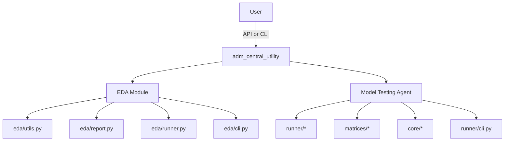

# ADM Central Utility

This project provides three main APIs:

- **EDA**: automated exploratory data analysis with PDF and JSON outputs.
- **Model Testing Agent**: comprehensive model evaluation with metrics, plots, and PDF reports.
- **Model Testing Agent (PySpark)**: Spark-based evaluation for large datasets and CML environments.

See module-specific docs:

- `eda/README.md`
- `model_testing_agent/README.md`
- `model_testing_agent_pyspark/README.md`

## EDA (High-Level)

The EDA module analyzes a dataset and generates a PDF/JSON report with overview, missingness, numeric/categorical summaries, correlation, outliers, and time-based analyses. Users can run all sections or pick specific sections/columns.

```python
from adm_central_utility import EDA

eda = EDA(output_dir="./output_eda", target_col="your_target")
results = eda.run(file_path="./path/to/your_dataset.csv")
```

## Model Testing Agent (High-Level)

The Model Testing Agent evaluates a classification model with effectiveness, efficiency, stability, and interpretability matrices. Users can run all matrices or select subsets interactively or via API/CLI.

```python
from adm_central_utility.model_testing_agent import ModelTestingAgent

model = ModelTestingAgent.load_model("./path/to/your_model.joblib")
X, y, feature_names = ModelTestingAgent.load_data("./path/to/your_dataset.csv", label_col="your_label")
agent = ModelTestingAgent(output_dir="./output")
results = agent.run(model=model, X=X, y=y, feature_names=feature_names)
agent.generate_report(results)
```

## Model Testing Agent (PySpark, High-Level)

```python
from adm_central_utility.model_testing_agent_pyspark import ModelTestingAgentSpark

model = ModelTestingAgentSpark.load_model("./path/to/your_model.joblib")
df, label_col, feature_cols = ModelTestingAgentSpark.load_data("./path/to/your_dataset.csv", label_col="your_label")
agent = ModelTestingAgentSpark(output_dir="./output")
results = agent.run(model=model, df=df, label_col=label_col, feature_cols=feature_cols)
agent.generate_report(results)
```

## Project Structure (Architecture)

- `__init__.py`: Exports `EDA` and `model_testing_agent` for top-level imports.
- `eda/`: EDA module (auto dataset detection, metrics, plots, PDF report).
  - `eda/runner.py`: `EDA` class entry point.
  - `eda/utils.py`: dataset auto-detection, column type detection, loaders.
  - `eda/report.py`: PDF report builder.
- `model_testing_agent/`: Model evaluation module.
  - `model_testing_agent/runner/main.py`: `ModelTestingAgent` (non-interactive).
  - `model_testing_agent/runner/interactive.py`: `InteractiveAgent`.
  - `model_testing_agent/runner/cli.py`: CLI entry point.
  - `model_testing_agent/matrices/`: Effectiveness, Efficiency, Stability, Interpretability.
  - `model_testing_agent/core/`: metrics, report builder, utilities.
- `scripts/`: synthetic dataset generation and model training.
  - `scripts/03_generate_bank_aml_dataset.py`: generates AML dataset.
  - `scripts/04_train_bank_aml_gbt_pipeline.py`: trains model and saves test set.
- `examples/`: example usage.
- `requirements.txt`, `setup.py`: dependency and packaging definitions.

## Architecture Diagram



## Installation (dbConda + IDE)

### Step 1 - Create a dbConda environment

1) Open a dbConda terminal.
2) Create a virtual environment:

```bash
conda create --name <env_name> python=<version>
# Example
conda create --name adm_central_utility python=3.11
```

3) Activate the environment:

```bash
conda activate adm_central_utility
```

4) If activation succeeds, the prompt should show:

```
(adm_central_utility) C:\>
```

5) Install pip inside the environment:

```bash
conda install pip
```

### Step 2 - Configure the IDE interpreter (example: PyCharm)

1) In the dbConda terminal, activate the environment and run:

```bash
where python
```

Note the full path to `python.exe` for this environment.

2) Open your IDE (e.g., PyCharm), then go to:

```
Settings | Project: <Path to Project location> | Project Interpreter
```

3) Click the gear icon and choose **Add Interpreter**.
4) Select **Conda Environment** and set the **Conda Executable** path so the IDE can load dbConda. A common location is:

```
C:\Users\<username>\dev\dbConda-2023_09-py311-r36\Scripts\conda.exe
```

Alternatively:

```
C:\Users\<username>\dev\dbConda-2023_09-py311-r36\condabin\conda.bat
```

5) Click **Load Environments** to read the dbConda environment list.
6) Choose **Existing environment** and select your environment (e.g., `adm_central_utility`).
7) If it does not appear, set the Interpreter path manually, for example:

```
C:\Users\<username>\dev\dbConda-2023_09-py311-r36\envs\adm_central_utility\python.exe
```

8) Apply the interpreter settings to the current project.

### Step 3 - Activate the environment in the IDE terminal

1) Open the IDE terminal.
2) If conda is already initialized, activate the environment:

```bash
conda activate adm_central_utility
```

3) If the terminal cannot find `conda`, run this once in system PowerShell:

```powershell
C:\Users\<username>\dev\dbConda-2023_09-py311-r36\condabin\conda.bat init powershell
```

Then reopen the IDE terminal and activate the environment again:

```bash
conda activate adm_central_utility
```

### Step 4 - Install project dependencies

After the environment and interpreter are set up, confirm the terminal prefix is the active environment, then:

1) In the IDE terminal, `cd` to the project root (e.g., `adm_central_utility`).
2) Install required packages:

```bash
pip install -r requirements.txt
```

3) Optional: if `pip install` fails, try one of the following in the **IDE terminal**:

```bat
for /f %i in (requirements.txt) do conda install %i -y
```

```bat
conda install -y -c conda-forge ^
  numpy pandas scikit-learn matplotlib reportlab joblib scipy shap numba llvmlite lime pytest
```

## How To Run on Windows (Developer / Repo Owner)

### 1) Setup (PowerShell)

```powershell
cd C:\path\to\adm_central_utility
python -m venv .venv
.\.venv\Scripts\Activate.ps1
pip install -r requirements.txt
```

If you use **cmd.exe** instead of PowerShell:

```bat
cd C:\path\to\adm_central_utility
python -m venv .venv
.\.venv\Scripts\activate.bat
pip install -r requirements.txt
```

### 2) Run EDA (CLI, PowerShell)

Full report:
```powershell
$env:MPLCONFIGDIR=".\.mpl_cache"
$env:MPLBACKEND="Agg"
eda-agent --data .\data\synthetic_bank_aml_200k.csv `
  --target-col is_suspicious `
  --output .\output_eda
```

Interactive selection:
```powershell
$env:MPLCONFIGDIR=".\.mpl_cache"
$env:MPLBACKEND="Agg"
eda-agent --data .\data\synthetic_bank_aml_200k.csv `
  --output .\output_eda `
  --interactive
```

### 3) Run model_testing_agent (CLI, PowerShell)

```powershell
$env:MPLCONFIGDIR=".\.mpl_cache"
$env:MPLBACKEND="Agg"
model-testing-agent `
  --model .\models\bank_aml_gbt_py39.joblib `
  --data .\data\synthetic_bank_aml_200k_test_py39.csv `
  --label_col is_suspicious `
  --output .\output
```

### 4) Run model_testing_agent_pyspark (CLI, PowerShell)

```powershell
New-Item -ItemType Directory -Force .\spark_tmp, .\output_spark | Out-Null

$env:JAVA_TOOL_OPTIONS="-Djava.io.tmpdir=.\spark_tmp"
$env:SPARK_LOCAL_DIRS=".\spark_tmp"
$env:SPARK_DRIVER_OPTS="-Djava.io.tmpdir=.\spark_tmp"
$env:SPARK_EXECUTOR_OPTS="-Djava.io.tmpdir=.\spark_tmp"
$env:MPLCONFIGDIR=".\.mpl_cache"
$env:MPLBACKEND="Agg"

python -m model_testing_agent_pyspark.runner.cli `
  --model .\models\bank_aml_gbt_py39.joblib `
  --data .\data\synthetic_bank_aml_200k_test_py39.csv `
  --label_col is_suspicious `
  --output .\output_spark
```

Output PDF:
- `.\output_eda\EDA_Report.pdf`
- `.\output\model_testing_agent_Model_Testing_Report.pdf`
- `.\output_spark\model_testing_agent_Model_Testing_Report_pyspark.pdf`

## How To Run on Windows (User / API Usage)

### 1) Install from repo

```powershell
pip install -e C:\path\to\adm_central_utility
```

### 2) EDA (API)

```python
from adm_central_utility import EDA

eda = EDA(output_dir="./output_eda", target_col="your_target")
eda.run(file_path=r"C:\path\to\your_dataset.csv")
```

Interactive section/column selection:
```python
from adm_central_utility import EDA

eda = EDA(output_dir="./output_eda", target_col="your_target")
eda.print_functions()
sections = EDA.parse_function_selection("1,2,3")

results = eda.run(
    file_path=r"C:\path\to\your_dataset.csv",
    sections=sections,
    section_columns={
        "numeric": ["col_a", "col_b"],
        "categorical": ["col_c"],
    },
)
```

### 3) model_testing_agent (API)

```python
from adm_central_utility.model_testing_agent import ModelTestingAgent

model = ModelTestingAgent.load_model(r"C:\path\to\your_model.joblib")
X, y, feature_names = ModelTestingAgent.load_data(r"C:\path\to\your_dataset.csv", label_col="your_label")

agent = ModelTestingAgent(output_dir="./output")
results = agent.run(model=model, X=X, y=y, feature_names=feature_names)
agent.generate_report(results)
```

Interactive:
```python
from adm_central_utility.model_testing_agent import InteractiveAgent

agent = InteractiveAgent(output_dir="./output")
agent.run_interactive(model=model, X=X, y=y, feature_names=list(X.columns))
```

### 4) model_testing_agent_pyspark (API)

```python
from adm_central_utility import model_testing_agent_pyspark

agent = model_testing_agent_pyspark.ModelTestingAgentSpark(output_dir="./output_spark")
model = agent.load_model(r"C:\path\to\your_model.joblib")
df, label_col, feature_cols = agent.load_data(r"C:\path\to\your_dataset.csv", label_col="your_label")

results = agent.run(model=model, df=df, label_col=label_col, feature_cols=feature_cols)
agent.generate_report(results)
```

Interactive:
```python
from adm_central_utility import model_testing_agent_pyspark

agent = model_testing_agent_pyspark.InteractiveAgentSpark(output_dir="./output_spark")
agent.run_interactive(model=model, df=df, label_col=label_col, feature_cols=feature_cols)
```

## Recommended Python 3.11 Environment (Conda)

SHAP installation is most reliable via conda-forge on Python 3.11. This avoids LLVM build issues.

```bash
conda create -p ./venv311 python=3.11 -y
conda install -p ./venv311 -c conda-forge \
  numpy pandas scikit-learn matplotlib joblib scipy \
  shap numba llvmlite lime -y
```

Run the project with:

```bash
./venv311/bin/python -m model_testing_agent.runner.cli --help
```

### SHAP Notes

- SHAP depends on `numba` and `llvmlite`. On some systems (especially Python 3.13), these may require LLVM and a C++ toolchain.
- If SHAP cannot be imported, the report will include the reason in the Interpretability section.
- For the easiest setup, use Python 3.11/3.12 where prebuilt wheels are typically available.

## Model Requirements (for Model Testing Agent)

- The joblib must load a scikit-learn compatible classifier or pipeline.
- `predict_proba` is strongly recommended for full metrics and interpretability.
- If only `decision_function` exists, AUC metrics still work but LIME will not.
- Input features must match the training schema (names, order, types).

## Model Testing Agent

### Quick Start (API)

```python
from adm_central_utility import model_testing_agent

model = model_testing_agent.ModelTestingAgent.load_model("./models/bank_aml_gbt.joblib")
X, y, feature_names = model_testing_agent.ModelTestingAgent.load_data(
    "./data/synthetic_bank_aml_200k_test.csv",
    label_col="is_suspicious",
)

agent = model_testing_agent.ModelTestingAgent(output_dir="./output")
results = agent.run(model=model, X=X, y=y, feature_names=feature_names)
agent.generate_report(results)
```

## EDA

### Quick Start

```python
from adm_central_utility import EDA

# Auto-detects the most recent dataset in ./data
eda = EDA(output_dir="./output_eda", target_col="is_suspicious")
results = eda.run()
```

You can also set an explicit dataset path using an environment variable:

```bash
export EDA_DATA_PATH=./data/synthetic_bank_aml_200k.csv
```

You can also pass a DataFrame or a file path:

```python
import pandas as pd
from adm_central_utility import EDA

df = pd.read_csv("./data/synthetic_bank_aml_200k.csv")
eda = EDA(output_dir="./output_eda", target_col="is_suspicious", time_col="txn_datetime")
results = eda.run(df=df)
```

### EDA Functions (Sections)

- `overview`: dataset shape, column types, unique counts, duplicate ratio, target distribution (if provided)
- `missingness`: missing value rates and plot
- `numeric`: numeric statistics and histograms
- `categorical`: top categories and frequency plots
- `correlation`: correlation heatmap and target correlation (if numeric target)
- `outliers`: IQR outlier ratios and plot
- `time`: time-series volume and optional target rate

### EDA: Select Functions and Columns

By default, `EDA.run()` executes all sections and generates a PDF report. You can select specific sections and columns.

```python
eda = EDA(output_dir="./output_eda", target_col="is_suspicious")
results = eda.run(
    sections=["overview", "missingness", "numeric"],
    columns=["txn_amount", "num_txn_24h", "kyc_risk_score"]
)
```

Per-section columns:

```python
results = eda.run(
    sections=["numeric", "categorical"],
    section_columns={
        "numeric": ["txn_amount", "avg_amount_7d"],
        "categorical": ["merchant_category", "payment_rail"],
    },
)
```

### EDA CLI

```bash
eda-agent --data ./data/synthetic_bank_aml_200k.csv --target-col is_suspicious --output ./output_eda
```

List functions and interactive selection:

```bash
eda-agent --list-functions
eda-agent --data ./path/to/your_dataset.csv --output ./output_eda --interactive
```

Auto-detect dataset (latest file in `./data`):

```bash
eda-agent --output ./output_eda
```

Select sections and columns:

```bash
eda-agent \
  --sections overview,missingness,numeric \
  --columns-numeric txn_amount,num_txn_24h,kyc_risk_score \
  --output ./output_eda
```

Skip JSON output (faster):

```bash
eda-agent --data ./path/to/your_dataset.csv --output ./output_eda --no-json
```

Limit rows for faster PDF:

```bash
eda-agent --data ./path/to/your_dataset.csv --output ./output_eda --max-rows 5000
```

### Model Testing Agent - CLI

```bash
model-testing-agent \
  --model ./models/bank_aml_gbt.joblib \
  --data ./data/synthetic_bank_aml_200k_test.csv \
  --label_col is_suspicious \
  --output ./output
```

### Model Testing Agent (PySpark) - CLI

```bash
model-testing-agent-spark \
  --model ./models/bank_aml_gbt.joblib \
  --data ./data/synthetic_bank_aml_200k_test.csv \
  --label_col is_suspicious \
  --output ./output
```

PySpark report filename:

- `model_testing_agent_Model_Testing_Report_pyspark.pdf`

### Interactive Mode

Interactive mode lets the user select which matrices to run and which columns to include for each matrix.

```python
from adm_central_utility.model_testing_agent import InteractiveAgent

agent = InteractiveAgent(output_dir="./output")
agent.run_interactive(model=model, X=X, y=y, feature_names=list(X.columns))
```

The interactive CLI will prompt for matrix selection and column indices per matrix.

### Non-Interactive Mode (All Sections)

If you do not choose sections or columns, the agent runs all matrices and generates a full PDF report.

```python
from adm_central_utility.model_testing_agent import ModelTestingAgent

agent = ModelTestingAgent(output_dir="./output")
results = agent.run(model=model, X=X, y=y)  # runs all sections
agent.generate_report(results)
```

### Synthetic AML Example (Scripts 03 & 04)

1) Generate dataset (with label noise):

```bash
python scripts/03_generate_bank_aml_dataset.py \
  --out-dir ./data \
  --rows 200000 \
  --suspicious-rate 0.04 \
  --label-noise 0.02 \
  --seed 7
```

2) Train model and save test set:

```bash
python scripts/04_train_bank_aml_gbt_pipeline.py \
  --data ./data/synthetic_bank_aml_200k.csv \
  --model ./models/bank_aml_gbt.joblib \
  --label-col is_suspicious \
  --test-size 0.3 \
  --seed 42
```

Notes:
- The dataset includes numeric-encoded categorical columns (e.g., `origin_country_code`).
- By default, training uses encoded categorical columns for full interpretability support.
- If you want to use raw string categorical columns with one-hot encoding, add `--use-raw-cats`.

This creates:
- `./models/bank_aml_gbt.joblib`
- `./data/synthetic_bank_aml_200k_test.csv` (saved by default)

3) Run evaluation:

```bash
model-testing-agent \
  --model ./models/bank_aml_gbt.joblib \
  --data ./data/synthetic_bank_aml_200k_test.csv \
  --label_col is_suspicious \
  --output ./output \
  --sections effectiveness,efficiency,stability,interpretability
```

### Choose Matrices and Columns

### Sections (matrices)

```python
results = agent.run(
    model=model,
    X=X,
    y=y,
    sections=["effectiveness", "stability"]
)
```

CLI:
```bash
--sections effectiveness,stability
```

### Columns (features)

You can pass a global column list or per-section columns. Only do this if your model accepts that subset.

```python
results = agent.run(
    model=model,
    X=X,
    y=y,
    columns=["txn_amount", "num_txn_24h"],
    section_columns={
        "stability": ["txn_amount", "kyc_risk_score"],
        "interpretability": ["txn_amount", "num_txn_24h"],
    },
)
```

CLI:
```bash
--columns txn_amount,num_txn_24h \
--columns-stability txn_amount,kyc_risk_score \
--columns-interpretability txn_amount,num_txn_24h
```

### Evaluation Matrices

### 1. Effectiveness
- ROC Curve & AUC-ROC
- PR Curve & AUC-PR
- Confusion Matrix (raw & normalized)
- Precision, Recall, F1 Score
- KS Statistic & KS Curve
- Precision@K & Recall@K

### 2. Efficiency
- False Positive Rate (FPR)
- FPR vs Threshold Analysis
- True Negatives & False Positives

### 3. Stability
- Population Stability Index (PSI)
- Data Drift Detection (per feature)
- Concept Drift Detection
- Cross-Validation Stability
- Bootstrap Stability & Confidence Intervals

### 4. Interpretability
- Permutation Importance
- SHAP Values & Summary Plot
- LIME Explanations
- Partial Dependence Plot (PDP)
- Individual Conditional Expectation (ICE)

### Output
- `model_testing_agent_Model_Testing_Report.pdf`
- `results.json`
- Various `.png` plot files

### EDA Output
- `EDA_Report.pdf`
- `eda_results.json`
- Various `.png` plot files

### EDA - Non-Interactive Full Report

If you do not specify sections or columns, the EDA runner will analyze all sections and generate a complete PDF report.

```python
from adm_central_utility import EDA

eda = EDA(output_dir="./output_eda", target_col="is_suspicious")
eda.run()  # auto-detects dataset in ./data and generates full report
```

## Report Explanations

Each matrix section includes result-aware text explanations based on the computed metrics and plots.

## EDA Performance Notes

- If you do not specify columns, EDA analyzes the top 5 numeric columns (by variance) and top 5 categorical columns (by unique count).
- Plots are generated at 80 DPI with smaller figure sizes by default for faster rendering.
- Time-series plots run only if the time column can be parsed successfully (>= 90% valid).
