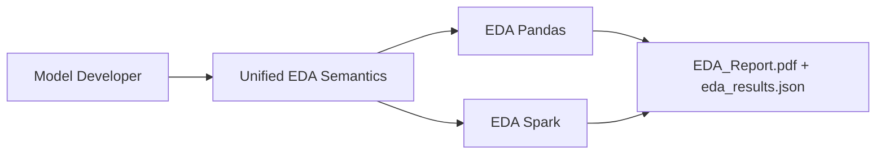

# 00 Overview (NotebookLM PPT Source Pack)

## Purpose
- This source pack is designed for NotebookLM to generate an **all-English PPT** for model developers.
- Deck topic: how to use `eda` and `eda_spark` in `model_agent_ai_agent` for fast, repeatable pre-modeling dataset analysis.

## Code-Verified Facts
- Two EDA engines:
- `EDA (Pandas)`: `eda/runner.py::EDA`
- `EDA Spark (PySpark)`: `eda_spark/runner.py::EDASpark`
- Both engines support CLI/API and the same input modes:
- `--data --sql --db --py --py-code --nb --data-recursive --compose-spec --no-key-policy --auto-exec`
- Both engines produce standardized artifacts:
- `<output_dir>/eda_results.json`
- `<output_dir>/EDA_Report.pdf`
- Shared analysis sections:
- `data_quality`
- `target`
- `univariate`
- `bivariate_target`
- `feature_vs_feature`
- `time_drift`

## Recommended NotebookLM Sources (English-First)
- `08_notebooklm_deck_story_en.md`: audience framing and deck narrative.
- `09_notebooklm_slide_content_en.md`: slide-by-slide content draft (12-14 slides).
- `10_notebooklm_demo_and_troubleshooting_en.md`: demo commands and troubleshooting checklist.
- `01_inputs_catalog.md`: input resolution and composition behavior.
- `02_eda_pipeline.md` and `03_eda_spark_pipeline.md`: pipeline flow references.
- `05_usage_modes.md` and `06_demo_paths_in_data_folder.md`: runnable commands and sample paths.

## Output Target
- A 15-20 minute English technical deck with 12-14 slides.
- Each slide should answer one practical model developer question:
- when to use it,
- how to run it,
- how to read outputs,
- what action to take next.

