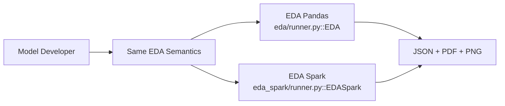

# 00 Overview (Model Developer Deck)

- This deck targets **model developers** who need fast, repeatable dataset understanding before modeling.
- The repository provides two EDA engines with the same analysis intent:
- **EDA (Pandas)** for local/smaller workflows (`eda/runner.py::EDA`).
- **EDA Spark (PySpark)** for larger/distributed workflows (`eda_spark/runner.py::EDASpark`).
- Both engines expose **CLI** and **API** usage, support multi-source input, and produce standardized artifacts:
- `eda_results.json` for machine-readable output.
- `EDA_Report.pdf` for human-readable report.
- Core developer value:
- One command/API call can replace repetitive manual profiling and charting.
- Teams get consistent section outputs across projects.
- Input flexibility reduces pre-processing overhead (files/folders/globs, SQL, `.py`, `.ipynb`).
- Current multi-table behavior (both engines):
- Compose by join keys (including inferred keys).
- Default `no_key_policy=error` (fail fast if tables cannot be joined).
- `aggregate_only` is opt-in fallback.

