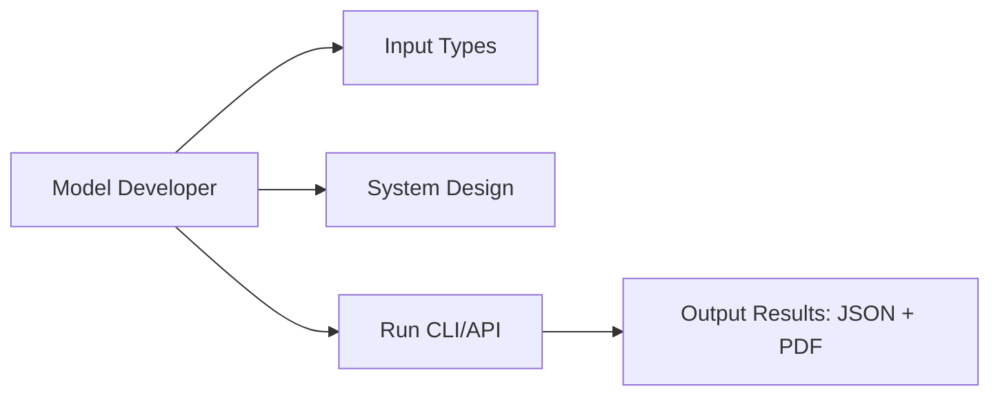

# 00 Overview (Model Developer-Focused NotebookLM Source Pack)

## Objective
This source pack is built for an English PPT that explains only three things for model developers:
- what input data types `eda` and `eda_spark` accept,
- how each system is designed,
- how to run CLI/API and interpret output **results**.

## Scope (No Legacy Narrative)
- Project: `model_agent_ai_agent`
- Engines:
- `EDA (Pandas)`: `eda/runner.py::EDA`
- `EDA Spark (PySpark)`: `eda_spark/runner.py::EDASpark`

## What the Deck Must Emphasize
- Inputs:
- `--data --sql --db --py --py-code --nb --data-recursive --compose-spec --no-key-policy --auto-exec`
- System design:
- CLI -> Runner -> DataLoader -> Section Functions -> JSON/PDF output
- Usage:
- CLI batch, CLI interactive, API batch, API interactive
- Output results:
- `<output_dir>/eda_results.json`
- `<output_dir>/EDA_Report.pdf`
- API return object (`results` by default; full payload with `return_payload=True`)

## Function Surfaces to Cover
- Public orchestration functions (both runners):
- `run()`
- `run_interactive()`
- `list_functions()`
- `parse_function_selection()`
- `parse_column_selection()`
- `print_functions()`
- Analysis function keys (both engines):
- `data_quality`
- `target`
- `univariate`
- `bivariate_target`
- `feature_vs_feature`
- `time_drift`

## Recommended NotebookLM Upload Order
1. `00_overview.md`
2. `01_inputs_catalog.md`
3. `02_eda_pipeline.md`
4. `03_eda_spark_pipeline.md`
5. `05_usage_modes.md`
6. `06_demo_paths_in_data_folder.md`
7. `08_notebooklm_deck_story_en.md`
8. `09_notebooklm_slide_content_en.md`
9. `10_notebooklm_demo_and_troubleshooting_en.md`

