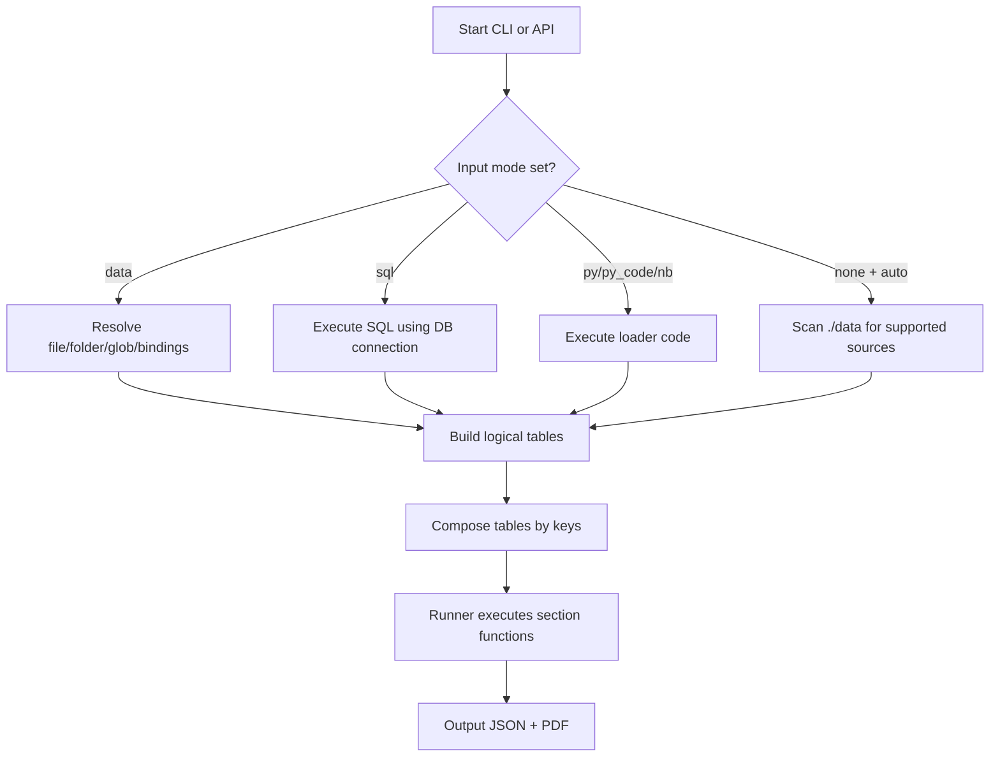

# 01 Inputs Catalog (Model Developer View)

## Goal
This document defines exactly what input types model developers can provide to `eda` and `eda_spark`, and how inputs flow into final EDA results.

## Engines and Loader Entry Points
- EDA (Pandas): `eda/cli.py` -> `eda/runner.py::EDA` -> `eda/dataloader.py::DataLoader.load`
- EDA Spark (PySpark): `eda_spark/cli.py` -> `eda_spark/runner.py::EDASpark` -> `eda_spark/dataloader.py::DataLoader.load`

## Input Mode Rule (Critical)
- Exactly one input mode per run: `data`, `sql`, `py`, `py_code`, or `nb`.
- If multiple are provided together, loader raises: `Only one input mode is allowed`.
- If no explicit mode is provided:
- `auto_exec=True` -> auto scan `./data`
- otherwise -> default data mode (latest detectable dataset or provided `--data`)

## Supported File Extensions (`--data` mode)
- `.csv`, `.tsv`, `.parquet`, `.json`, `.xlsx`, `.xls`, `.feather`

## Input Type Matrix

| Input type | EDA | EDA Spark | CLI pattern | API pattern | Notes |
|---|---|---|---|---|---|
| Single file | Yes | Yes | `--data ./data/file.csv` | `run(data=["./data/file.csv"])` | Most common model-dev path |
| Multiple files | Yes | Yes | repeat `--data` | `run(data=[...])` | Files grouped to logical tables then composed |
| Directory | Yes | Yes | `--data ./data/folder` | `run(data=["./data/folder"])` | Supported extensions only |
| Glob | Yes | Yes | `--data './data/**/*.csv' --data-recursive` | `run(data=["./data/**/*.csv"], recursive=True)` | Recursive matching supported |
| Named table bindings | Yes | Yes | `--data transaction=... --data customer=...` | `run(data=["transaction=...","customer=..."])` | Enables explicit logical tables |
| SQL query or SQL file | Yes | Yes | `--sql ... --db ...` | `run(sql="...", db="...")` | `--db` is required in SQL mode |
| Python loader file | Yes | Yes | `--py ./data/loader.py` | `run(py="./data/loader.py")` | Must expose `load()` or `df` |
| Inline Python | Yes | Yes | `--py-code '...'` | `run(py_code="...")` | Must define `load()` or `df` |
| Notebook loader | Yes | Yes | `--nb ./data/loader.ipynb` | `run(nb="./data/loader.ipynb")` | Code cells are executed |
| Auto scan from `./data` | Yes | Yes | no input mode + `--auto-exec` optional | `run(auto_exec=True)` | Loads data/sql/py/ipynb then composes |

## Multi-Table Composition Semantics
- Composition engines:
- Pandas: `_compose_tables_pandas(...)`
- Spark: `_compose_tables_spark(...)`
- Explicit composition:
- `--compose-spec <json string or json file>`
- Join failure policy:
- default `--no-key-policy error`
- fallback `--no-key-policy aggregate_only`

## Input-to-Output Contract
Any accepted input mode eventually produces:
- a working DataFrame for section execution,
- `eda_results.json` (machine-readable results),
- `EDA_Report.pdf` (human-readable report).

## Input Resolution Flow

