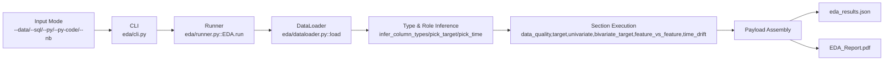

# 02 EDA (Pandas) System Design for Model Developers

## End-to-End Architecture (Input -> Engine -> Output)

## Engine Responsibilities
- Parse user intent from CLI/API.
- Resolve one input mode and load a pandas DataFrame.
- Infer column families, target column, and time column.
- Execute section blocks with prerequisite checks.
- Persist structured JSON and PDF report.

## Section Blocks and What They Run

### `data_quality`
- Row/column counts and duplicate ratio.
- Missingness counts/rates and missingness plot.
- Null-like value detection.
- Column type summary.
- Outlier-ratio style validity checks.

### `target`
- Target distribution (classification-like) or stats (continuous-like).
- Target trend over time (if time column is valid).
- Target rate by key categorical dimensions.

### `univariate`
- Numeric descriptive stats and histograms.
- Categorical top-k frequency tables/charts.

### `bivariate_target`
- Numeric bins vs target rate/mean.
- Categorical groups vs target rate/mean.

### `feature_vs_feature`
- Numeric correlation matrix and heatmap.
- Highly correlated pair detection.

### `time_drift`
- Time-bucket volume trend.
- Amount trend where applicable.
- Numeric PSI drift and categorical drift signals.

## Public Runner Functions to Show in Deck
- `run()`
- `run_interactive()`
- `list_functions()`
- `parse_function_selection()`
- `parse_column_selection()`
- `print_functions()`

## Output Objects Model Developers Use
- Files:
- `./output_eda/eda_results.json`
- `./output_eda/EDA_Report.pdf`
- API return:
- default: `results`
- optional full payload: `return_payload=True` -> `results`, `skipped_sections`, `config`.

## Section Skip Logic (Important for Interpretation)
- `target` / `bivariate_target` skip when no valid target column is available.
- `time_drift` skips when no parseable time column is available.
- `feature_vs_feature` needs at least two numeric columns.
