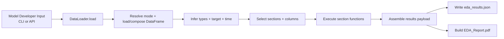

# 02 EDA System Design (Pandas)

## System Design Objective
Explain how `EDA` (Pandas) turns model-developer inputs into standardized result outputs.

## Component Design

| Layer | File | Responsibility | Key functions |
|---|---|---|---|
| CLI | `eda/cli.py` | Parse arguments and dispatch run mode | `main()` |
| Runner | `eda/runner.py` | End-to-end orchestration | `run()`, `run_interactive()` |
| Function catalog | `eda/runner.py` | Expose selectable analysis functions | `list_functions()`, `print_functions()`, `parse_function_selection()`, `parse_column_selection()` |
| Data loader | `eda/dataloader.py` | Resolve input mode and load/compose data | `DataLoader.load()` |
| Utilities | `eda/utils.py` | Infer types/target/time and data profiling helpers | `infer_column_types()`, `pick_target_column()`, `pick_time_column()` |
| Report builder | `eda/report.py` | Build PDF report | `EDAReportBuilder.build()` |

## Analysis Function Keys (for model developers)
- `data_quality`
- `target`
- `univariate`
- `bivariate_target`
- `feature_vs_feature`
- `time_drift`

## Runtime Pipeline



## API Return and Output Results
- Default API call:
- `results = EDA(...).run(...)`
- Return value: section-keyed `results` dict.
- Full payload option:
- `payload = EDA(...).run(..., return_payload=True)`
- Includes:
- `results`
- `skipped_sections`
- `config` (data path, rows used, target/time columns, parse ratio, composition metadata)

## Result Payload Shape (with `return_payload=True`)

```json
{
  "results": {
    "data_quality": {},
    "target": {},
    "univariate": {},
    "bivariate_target": {},
    "feature_vs_feature": {},
    "time_drift": {}
  },
  "skipped_sections": [
    {"section": "time_drift", "reason": "No valid time column"}
  ],
  "config": {
    "data_path": "...",
    "rows_original": 100000,
    "rows_used": 100000,
    "target_col": "is_suspicious",
    "time_col": "txn_ts",
    "time_parse_ratio": 0.98
  }
}
```

## Minimal Usage Examples (Pandas)

### CLI
```bash
python -m eda.cli --data ./data/transactions.csv --target-col is_suspicious --output ./output_eda
```

### API
```python
from adm_central_utility import EDA

eda = EDA(output_dir="./output_eda", target_col="is_suspicious")
results = eda.run(
    data=["./data/transactions.csv"],
    sections=["data_quality", "target", "univariate"],
)
```

## What Model Developers Should Read First
- `eda_results.json` for machine-consumable checks and downstream automation.
- `EDA_Report.pdf` for presentation and review.
