# 02 EDA Pipeline (Pandas)

## System Pipeline (Model Developer View)

```mermaid
flowchart LR
  A[CLI/API\neda/cli.py::main\nEDA.run()] --> B[DataLoader\neda/dataloader.py::DataLoader.load]
  B --> C[Input resolution\nmode + source expansion]
  C --> D[Logical table map\n+ key-based composition]
  D --> E[Type inference\neda/utils.py::infer_column_types]
  E --> F[Auto target/time detection\npick_target_column + pick_time_column]
  F --> G[Section orchestration\nEDA._check_prerequisites]
  G --> H1[data_quality]
  G --> H2[target]
  G --> H3[univariate]
  G --> H4[bivariate_target]
  G --> H5[feature_vs_feature]
  G --> H6[time_drift]
  H1 --> I[Assemble payload]
  H2 --> I
  H3 --> I
  H4 --> I
  H5 --> I
  H6 --> I
  I --> J[Write JSON\noutput/eda_results.json]
  I --> K[Build PDF\noutput/EDA_Report.pdf]
```

## Section Profiling Map

```mermaid
flowchart TD
  S[EDA.SECTION_INFO\neda/runner.py] --> Q[Data Quality]
  S --> T[Target]
  S --> U[Univariate]
  S --> V[Bivariate with Target]
  S --> W[Feature vs Feature]
  S --> X[Time Series and Drift]

  Q --> Q1[Rows/columns/duplicates]
  Q --> Q2[Missingness + null-like values]
  Q --> Q3[Type classification + outlier ratio]

  T --> T1[Target distribution/statistics]
  T --> T2[Target trend over time]
  T --> T3[Target rate by categorical columns]

  U --> U1[Numeric summary statistics]
  U --> U2[Histograms]
  U --> U3[Categorical top-k tables/charts]

  V --> V1[Numeric bins vs target]
  V --> V2[Categorical rates vs target]

  W --> W1[Correlation matrix + heatmap]
  W --> W2[Highly correlated pairs]

  X --> X1[Time volume trend]
  X --> X2[Amount trend if amount-like column exists]
  X --> X3[Numeric PSI + categorical drift]
```



## What PDF Contains (High-Level Slide Structure)
- Cover / Dataset Overview:
- Data path, rows used, target column, time column.
- Part 1: Data Quality:
- Summary bullets, missingness table, null-like values table, type classification, outlier ratio, charts.
- Part 2+: Section pages for selected analyses:
- Target, Univariate, Bivariate Target, Feature vs Feature, Time Drift.
- Each section can include summary bullets, tables, charts.
- Final pages:
- Skipped sections table (with reasons).
- Run configuration table.

## Output Artifacts (Exact Filenames)
- JSON: `<output_dir>/eda_results.json`
- PDF: `<output_dir>/<report_name>` default `EDA_Report.pdf`
- Typical plots written to `<output_dir>/`:
- `missingness.png`
- `outlier_iqr.png`
- `target_rate_over_time.png` or `target_mean_over_time.png`
- `target_rate_by_<col>.png`
- `hist_<col>.png`
- `cat_<col>.png`
- `target_rate_bins_<col>.png`
- `target_rate_cat_<col>.png`
- `correlation_heatmap.png`
- `time_volume.png`
- `time_amount_mean.png`

## Why This Helps Model Developers
- Fast baseline understanding of new datasets before feature engineering.
- Consistent, reusable analysis sections across projects.
- Reduces ad-hoc notebook profiling and manual chart building.
