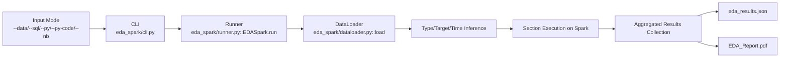

# 03 EDA Spark (PySpark) System Design for Model Developers

## End-to-End Architecture (Input -> Engine -> Output)

## Spark Execution Design
- Driver side:
- Controls orchestration, section logic, output payload, and PDF composition.
- Executor side:
- Runs distributed scans, group-bys, joins, correlations, and drift computations.
- Plotting/reporting:
- Uses small aggregated outputs collected back from Spark.

## Section Blocks and What They Run
Section semantics are aligned with pandas EDA:
- `data_quality`: duplicates, missingness, null-like checks, type profile.
- `target`: distribution/statistics, time trend, categorical target rates.
- `univariate`: numeric/categorical one-variable profiling.
- `bivariate_target`: feature-target bin/group analysis.
- `feature_vs_feature`: correlation matrix and strong-pair detection.
- `time_drift`: trend + drift monitoring signals.

## Public Runner Functions to Show in Deck
- `run()`
- `run_interactive()`
- `list_functions()`
- `parse_function_selection()`
- `parse_column_selection()`
- `print_functions()`

## Input Constraints to Emphasize
- One input mode per run.
- Multi-table row-level composition requires reliable join keys.
- Default strict behavior is fail-fast when composition cannot be inferred.
- Python/Notebook loaders must expose `load()` or `df`.

## Output Objects Model Developers Use
- Files:
- `./output_eda_spark/eda_results.json`
- `./output_eda_spark/EDA_Report.pdf`
- API return:
- default: `results`
- optional full payload (`return_payload=True`): `results`, `skipped_sections`, `config`.
