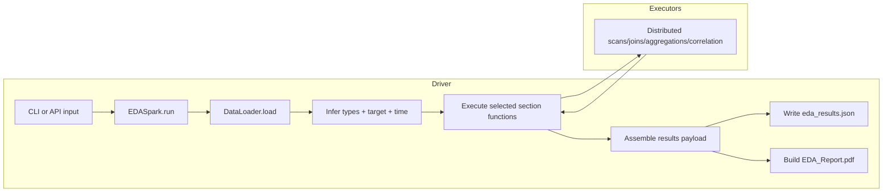

# 03 EDA Spark System Design (PySpark)

## System Design Objective
Explain how `EDASpark` turns model-developer inputs into distributed computation results and standardized outputs.

## Component Design

| Layer | File | Responsibility | Key functions |
|---|---|---|---|
| CLI | `eda_spark/cli.py` | Parse Spark + EDA args and dispatch run mode | `main()` |
| Runner | `eda_spark/runner.py` | Driver-side orchestration over Spark execution | `run()`, `run_interactive()` |
| Function catalog | `eda_spark/runner.py` | Expose selectable analysis functions | `list_functions()`, `print_functions()`, `parse_function_selection()`, `parse_column_selection()` |
| Data loader | `eda_spark/dataloader.py` | Load/compose Spark DataFrames from multiple modes | `DataLoader.load()` |
| Spark utilities | `eda_spark/utils.py` | Infer types/target/time and path helpers | `infer_column_types()`, `pick_target_column()`, `pick_time_column()`, `time_parse_ratio()` |
| Report builder | `eda_spark/report.py` | Build PDF from aggregated results | `EDAReportBuilder.build()` |

## Analysis Function Keys (same semantics as Pandas)
- `data_quality`
- `target`
- `univariate`
- `bivariate_target`
- `feature_vs_feature`
- `time_drift`

## Driver-Executor Runtime Pipeline



## API Return and Output Results
- Default API call:
- `results = EDASpark(...).run(...)`
- Return value: section-keyed `results` dict.
- Full payload option:
- `payload = EDASpark(...).run(..., return_payload=True)`
- Includes `results`, `skipped_sections`, and `config`.

## Result Payload Shape (with `return_payload=True`)

```json
{
  "results": {
    "data_quality": {},
    "target": {},
    "univariate": {},
    "bivariate_target": {},
    "feature_vs_feature": {},
    "time_drift": {}
  },
  "skipped_sections": [],
  "config": {
    "data_path": "...",
    "rows_used": 500000,
    "target_col": "sar_actual",
    "time_col": "txn_ts",
    "time_parse_ratio": 0.97
  }
}
```

## Minimal Usage Examples (Spark)

### CLI
```bash
python -m eda_spark.cli \
  --data ./data/transactions.parquet \
  --target-col sar_actual \
  --spark-master "local[*]" \
  --output ./output_eda_spark
```

### API
```python
from eda_spark.runner import EDASpark

eda = EDASpark(output_dir="./output_eda_spark", spark_master="local[*]", target_col="sar_actual")
results = eda.run(
    data=["./data/transactions.parquet"],
    sections=["data_quality", "target", "univariate"],
)
```

## What Model Developers Should Read First
- `eda_results.json` for programmatic result consumption.
- `EDA_Report.pdf` for human review and communication.
