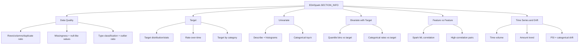

# 03 EDA Spark Pipeline (PySpark)

## Driver vs Executor Pipeline

```mermaid
flowchart LR
  subgraph D[Driver]
    A[CLI/API\neda_spark/cli.py::main\nEDASpark.run()] --> B[Create SparkSession\nEDASpark.__init__]
    B --> C[DataLoader.load\nmode + input resolution]
    C --> D1[Logical table map\n+ key-based composition]
    D1 --> E[Infer column types\neda_spark/utils.py::infer_column_types]
    E --> F[Auto target/time detection\npick_target_column + pick_time_column]
    F --> G[Run selected sections\n_check_prerequisites + _section_*]
    G --> H[Assemble payload]
    H --> I[Write JSON\noutput/eda_results.json]
    H --> J[Build PDF\noutput/EDA_Report.pdf]
  end

  subgraph X[Executors]
    K[Distributed computations\ncount/groupBy/approxQuantile\ncorrelation/drift prep]
  end

  G --> K
  K --> G
  G --> L[Small result collection\ntoPandas for plotting]
```

## Distributed vs Driver Responsibilities

| Stage | Main execution location | Notes |
|---|---|---|
| Source reading into Spark DataFrame | Driver orchestrates, IO/scan distributed | Spark-native reads for csv/parquet/json; Excel may use plugin or pandas fallback |
| Multi-table composition | Spark joins on driver-planned join graph, execution distributed | Join mapping inferred or from `compose_spec` |
| Section aggregations | Mostly distributed | `count`, `groupBy`, quantiles, correlations |
| Plot generation | Driver | Plot functions consume small local/pandas results |
| PDF generation | Driver | `eda_spark/report.py::EDAReportBuilder` |

## Section Profiling Map



## What PDF Contains (High-Level)
- Cover / Dataset overview.
- Data Quality section.
- Selected analysis section pages (Target, Univariate, Bivariate Target, Feature vs Feature, Time Drift).
- Skipped sections page.
- Run configuration page.

## Output Artifacts
- JSON: `<output_dir>/eda_results.json`
- PDF: `<output_dir>/<report_name>` default `EDA_Report.pdf`
- Plot files: same naming scheme as Pandas runner (`missingness.png`, `hist_*.png`, `correlation_heatmap.png`, etc.).

## Why This Helps Model Developers
- Keeps heavy computation in Spark while preserving report semantics similar to Pandas EDA.
- Enables fast model-readiness checks on larger datasets with standardized outputs.
