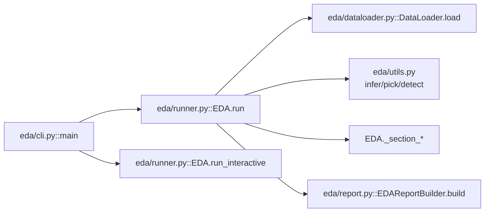
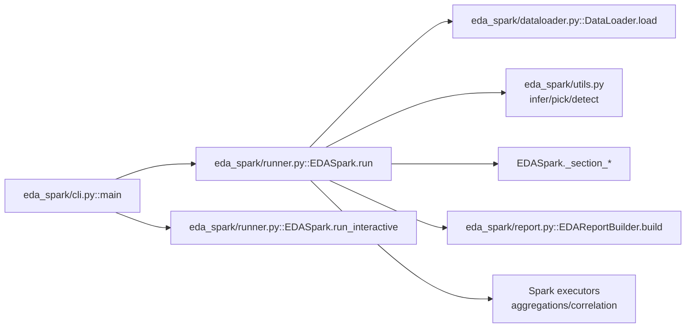
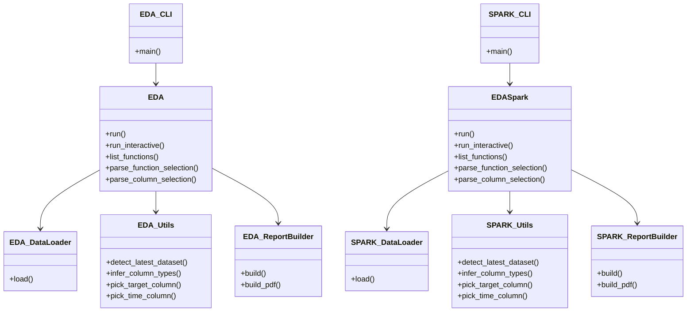

# 04 Class and Module Map

## EDA (Pandas) Component Responsibilities

| Component | File path | Responsibility | Key methods/functions |
|---|---|---|---|
| CLI entry | `eda/cli.py` | Parse flags, choose run mode, dispatch to `EDA` | `main()` |
| Orchestrator | `eda/runner.py` (`class EDA`) | End-to-end pipeline orchestration | `run()`, `run_interactive()`, `list_functions()`, `parse_function_selection()`, `parse_column_selection()`, `print_functions()` |
| Data loader | `eda/dataloader.py` (`class DataLoader`) | Resolve input mode, load sources, compose multi-table data by keys | `load()` |
| Loader internals | `eda/dataloader.py` | Key inference and table composition | `_infer_join_mapping_pandas()`, `_compose_tables_pandas()` |
| Profiling utils | `eda/utils.py` | Data-path detection, type/target/time inference, null-like detection | `detect_latest_dataset()`, `infer_column_types()`, `pick_target_column()`, `pick_time_column()`, `detect_null_like_values()` |
| Report builder | `eda/report.py` (`class EDAReportBuilder`) | Build final PDF report | `build()`, `build_pdf()` |

## EDA Spark (PySpark) Component Responsibilities

| Component | File path | Responsibility | Key methods/functions |
|---|---|---|---|
| CLI entry | `eda_spark/cli.py` | Parse Spark flags and dispatch to `EDASpark` | `main()` |
| Orchestrator | `eda_spark/runner.py` (`class EDASpark`) | Spark-first end-to-end orchestration | `run()`, `run_interactive()`, `list_functions()`, `parse_function_selection()`, `parse_column_selection()`, `print_functions()` |
| Data loader | `eda_spark/dataloader.py` (`class DataLoader`) | Resolve input mode, ingest/execute sources, compose by keys | `load()` |
| Loader internals | `eda_spark/dataloader.py` | Spark join inference and table composition | `_infer_join_mapping_spark()`, `_compose_tables_spark()` |
| Spark utils | `eda_spark/utils.py` | Spark type/target/time helpers + local URI handling | `detect_latest_dataset()`, `infer_column_types()`, `pick_target_column()`, `pick_time_column()`, `time_parse_ratio()`, `to_local_file_uri()` |
| Report builder | `eda_spark/report.py` (`class EDAReportBuilder`) | Build final PDF report | `build()`, `build_pdf()` |

## High-Level Function Catalog (Both Engines)
- `data_quality`: dataset shape, duplicates, missingness, null-like placeholders, type classification, outlier ratios.
- `target`: target distribution/statistics, time trend, target by category.
- `univariate`: numeric stats/histograms and categorical top-k.
- `bivariate_target`: feature vs target rates/means.
- `feature_vs_feature`: correlation heatmap and high-correlation pairs.
- `time_drift`: time volume, amount trend, PSI/categorical drift.

## System Design Diagram (Pandas)

## System Design Diagram (Spark)

## Class/Component Diagram

