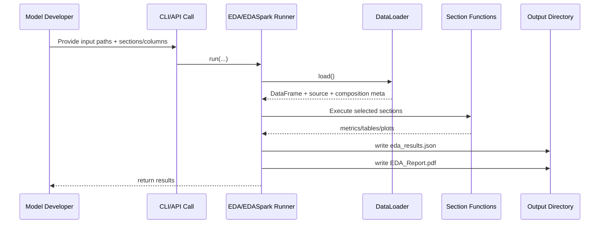
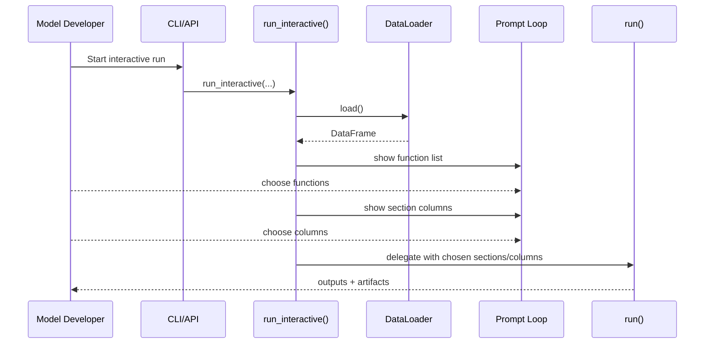

# 05 Usage Modes (CLI and API)

## Goal for Model Developers
- Run standardized EDA quickly on new datasets.
- Select only needed analysis functions.
- Control which columns are profiled.
- Generate JSON/PDF artifacts without writing custom profiling notebooks.

## A) Non-Interactive Mode (Batch)

### EDA CLI (Pandas)
```bash
# Auto mode from ./data
python -m eda.cli --output ./output_eda

# Explicit input docs from ./data
python -m eda.cli --data ./data/transactions.csv --output ./output_eda
python -m eda.cli --data ./data/part1.csv --data ./data/part2.csv --output ./output_eda
python -m eda.cli --data './data/**/*.csv' --data-recursive --output ./output_eda

# Choose specific functions and columns
python -m eda.cli \
  --data ./data/transactions.csv \
  --sections data_quality,univariate,time_drift \
  --columns-univariate txn_amount,origin_country \
  --output ./output_eda
```

### EDA Spark CLI (PySpark)
```bash
# Auto mode from ./data
python -m eda_spark.cli --spark-master "local[*]" --output ./output_eda_spark

# Explicit input docs
python -m eda_spark.cli --data ./data/transactions.parquet --spark-master "local[*]" --output ./output_eda_spark

# Choose specific functions and columns
python -m eda_spark.cli \
  --data ./data/transactions.parquet \
  --sections data_quality,target,univariate \
  --columns txn_amount,velocity_score \
  --spark-master "local[*]" \
  --output ./output_eda_spark
```

### EDA API (Pandas)
```python
from adm_central_utility import EDA

eda = EDA(output_dir="./output_eda", target_col="sar_actual")
eda.run(
    data=["./data/transactions.csv"],
    sections=["data_quality", "univariate", "time_drift"],
    section_columns={"univariate": ["txn_amount", "origin_country"]},
)
```

### EDA Spark API (PySpark)
```python
from eda_spark.runner import EDASpark

eda = EDASpark(output_dir="./output_eda_spark", spark_master="local[*]", target_col="sar_actual")
eda.run(
    data=["./data/transactions.parquet"],
    sections=["data_quality", "target", "univariate"],
    section_columns={"univariate": ["txn_amount", "velocity_score"]},
)
```

## B) Interactive Mode

### CLI Interactive
```bash
# List available functions first
python -m eda.cli --list-functions
python -m eda_spark.cli --list-functions

# Run interactive prompts
python -m eda.cli --interactive --data ./data/transactions.csv --output ./output_eda
python -m eda_spark.cli --interactive --data ./data/transactions.csv --spark-master "local[*]" --output ./output_eda_spark
```

### API Interactive
```python
from adm_central_utility import EDA
from eda_spark.runner import EDASpark

EDA(output_dir="./output_eda").run_interactive(data=["./data/transactions.csv"])
EDASpark(output_dir="./output_eda_spark", spark_master="local[*]").run_interactive(data=["./data/transactions.csv"])
```

### How function/column selection works in interactive mode
- Prompt 1: select functions by number or `all`.
- Prompt 2: for each selected function, select columns by number/name or Enter for defaults.
- Internally handled by:
- `parse_function_selection()`
- `parse_column_selection()`

## C) How Developers Choose Specific Input Docs
- Specific files:
- `--data ./data/a.csv --data ./data/b.csv`
- Folder:
- `--data ./data/batch_2026_01`
- Glob:
- `--data './data/aml/**/*.parquet' --data-recursive`
- Explicit table names for join modeling:
- `--data transaction=./data/transaction.csv --data customer=./data/customer.csv --data account=./data/account.csv`

## D) Non-Interactive Sequence



## E) Interactive Sequence


