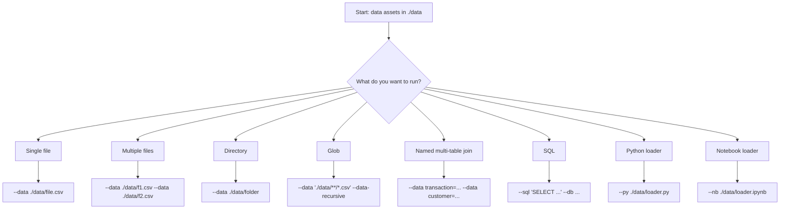

# 06 Demo: Choosing Input Docs in `./data`

## Choose Your Input Pattern



## Pattern 1: Single Dataset
```bash
python -m eda.cli --data ./data/transactions.csv --output ./output_eda
python -m eda_spark.cli --data ./data/transactions.csv --spark-master "local[*]" --output ./output_eda_spark
```

## Pattern 2: Multiple Input Files
```bash
python -m eda.cli --data ./data/part1.csv --data ./data/part2.csv --output ./output_eda
python -m eda_spark.cli --data ./data/part1.csv --data ./data/part2.csv --spark-master "local[*]" --output ./output_eda_spark
```

## Pattern 3: Folder / Recursive / Glob
```bash
python -m eda.cli --data ./data/shards --output ./output_eda
python -m eda.cli --data './data/shards/**/*.csv' --data-recursive --output ./output_eda

python -m eda_spark.cli --data ./data/shards --spark-master "local[*]" --output ./output_eda_spark
python -m eda_spark.cli --data './data/shards/**/*.csv' --data-recursive --spark-master "local[*]" --output ./output_eda_spark
```

## Pattern 4: Named Multi-Table Join Modeling
```bash
python -m eda.cli \
  --data transaction=./data/transaction.csv \
  --data customer=./data/customer.csv \
  --data account=./data/account.csv \
  --output ./output_eda

python -m eda_spark.cli \
  --data transaction=./data/transaction.csv \
  --data customer=./data/customer.csv \
  --data account=./data/account.csv \
  --spark-master "local[*]" \
  --output ./output_eda_spark
```

## Pattern 5: Named Multi-Table + Explicit Join Spec
```bash
python -m eda.cli \
  --data transaction=./data/transaction.csv \
  --data customer=./data/customer.csv \
  --data account=./data/account.csv \
  --compose-spec ./data/compose_spec.json \
  --output ./output_eda

python -m eda_spark.cli \
  --data transaction=./data/transaction.csv \
  --data customer=./data/customer.csv \
  --data account=./data/account.csv \
  --compose-spec ./data/compose_spec.json \
  --spark-master "local[*]" \
  --output ./output_eda_spark
```

## Pattern 6: SQL / Python / Notebook Inputs
```bash
# SQL
python -m eda.cli --sql "SELECT * FROM aml_dataset" --db "sqlite:///./data/aml.db" --output ./output_eda
python -m eda_spark.cli --sql "SELECT * FROM aml_dataset" --db "sqlite:///./data/aml.db" --spark-master "local[*]" --output ./output_eda_spark

# Python loader
python -m eda.cli --py ./data/eda_input_loader.py --output ./output_eda
python -m eda_spark.cli --py ./data/eda_spark_input_loader.py --spark-master "local[*]" --output ./output_eda_spark

# Notebook loader
python -m eda.cli --nb ./data/eda_input_loader.ipynb --output ./output_eda
python -m eda_spark.cli --nb ./data/eda_spark_input_loader.ipynb --spark-master "local[*]" --output ./output_eda_spark
```

## Notes for Current Composition Semantics
- Default is key-based composition across logical tables.
- Default policy is fail-fast when no join keys can be found (`no_key_policy=error`).
- Optional fallback if needed:
```bash
--no-key-policy aggregate_only
```
