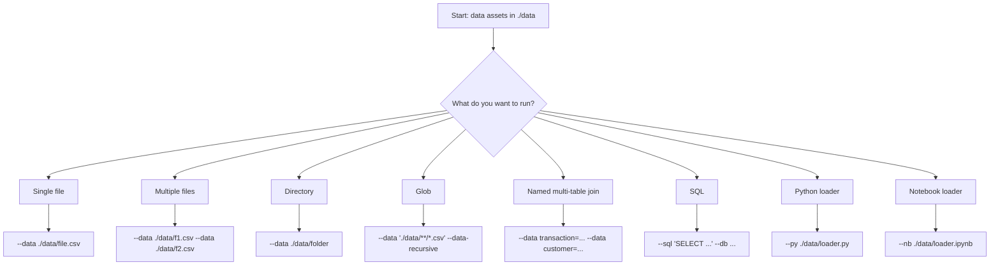

# choose input in data

```mermaid
flowchart TD
  A[Start: data assets in ./data] --> B{What do you want to run?}
  B --> C[Single file]
  B --> D[Multiple files]
  B --> E[Directory]
  B --> F[Glob]
  B --> G[Named multi-table join]
  B --> H[SQL]
  B --> I[Python loader]
  B --> J[Notebook loader]

  C --> C1[--data ./data/file.csv]
  D --> D1[--data ./data/f1.csv --data ./data/f2.csv]
  E --> E1[--data ./data/folder]
  F --> F1[--data './data/**/*.csv' --data-recursive]
  G --> G1[--data transaction=... --data customer=...]
  H --> H1[--sql 'SELECT ...' --db ...]
  I --> I1[--py ./data/loader.py]
  J --> J1[--nb ./data/loader.ipynb]
```
