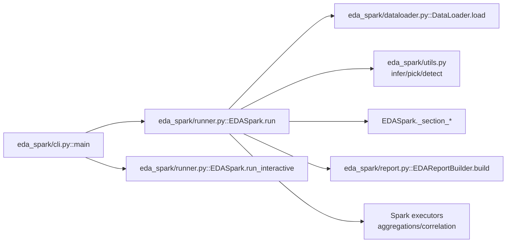

# component map eda spark

```mermaid
flowchart LR
  CLI[eda_spark/cli.py::main] --> RUN[eda_spark/runner.py::EDASpark.run]
  CLI --> IRUN[eda_spark/runner.py::EDASpark.run_interactive]
  RUN --> DL[eda_spark/dataloader.py::DataLoader.load]
  RUN --> U[eda_spark/utils.py\ninfer/pick/detect]
  RUN --> SEC[EDASpark._section_*]
  RUN --> REP[eda_spark/report.py::EDAReportBuilder.build]
  RUN --> SP[Spark executors\naggregations/correlation]
```
