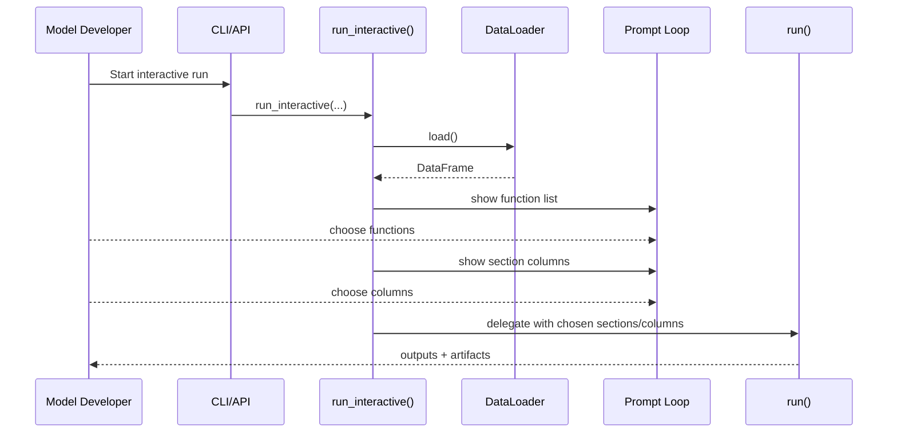

# usage interactive sequence

```mermaid
sequenceDiagram
  participant U as Model Developer
  participant C as CLI/API
  participant R as run_interactive()
  participant L as DataLoader
  participant P as Prompt Loop
  participant R2 as run()

  U->>C: Start interactive run
  C->>R: run_interactive(...)
  R->>L: load()
  L-->>R: DataFrame
  R->>P: show function list
  U-->>P: choose functions
  R->>P: show section columns
  U-->>P: choose columns
  R->>R2: delegate with chosen sections/columns
  R2-->>U: outputs + artifacts
```
